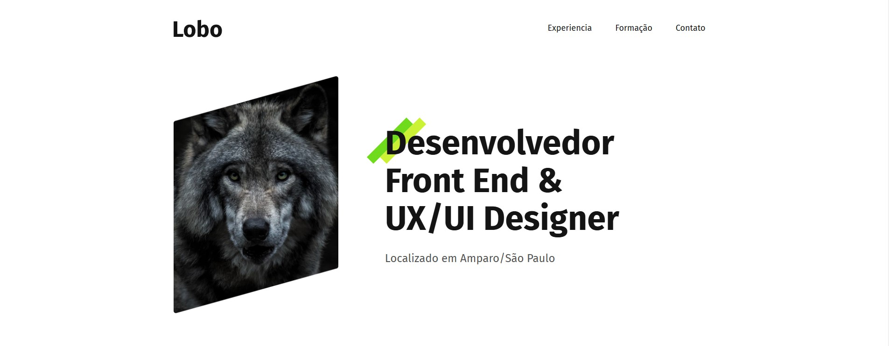

# Projeto Portfolio Lobo - Origamid

## ÍNDICE
- Sobre o Projeto
- Tecnologias Utilizadas 
- Acesse Aqui 

## 📝 SOBRE O PROJETO
O Portfolio Lobo da Origamid é um projeto desenvolvido durante o curso de HTML e CSS da Origamid. É um portfolio fictício que busca colocar em praticar tudo que venho aprendendo neste curso.

Nesse projeto foi implementando responsivo para se adaptar diferentes tipos de telas incluindo tablet e mobile. 👨‍💻

## 📱 TECNOLOGIAS UTILIZADAS
- HTML
- CSS
- Figma (para prototipagem do projeto)

## 👇 ACESSE AQUI
Acesse o projeto no link ao lado <a href="https://portfolio-lobo-origamid.vercel.app/">Deployed do projeto!🐺</a>